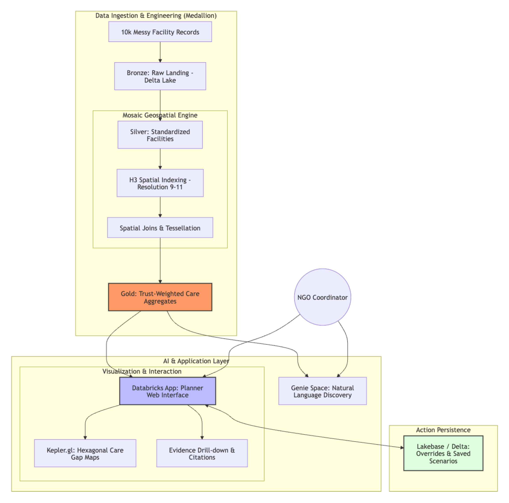

# Logical Architecture

The Trust-Weighted Care Gap Navigator runs on the Databricks Data Intelligence
Platform as a **Geospatial Lakehouse** (medallion architecture) plus a
Streamlit-on-pydeck app served as a Databricks App.

## 1 · Geospatial Lakehouse (Bronze · Silver · Gold)

| Layer | What it does | How |
| --- | --- | --- |
| **Bronze** | Lands the three raw upstream tables (`facilities`, `india_post_pincode_directory`, `nfhs_5_district_health_indicators`) verbatim | Metadata-driven runner reads `config/ingestion/sources.yml` and writes Delta tables with audit columns. See [ingestion.md](ingestion.md). |
| **Silver** | Cleans coordinates, canonicalises state names via a curated alias table, geocodes facilities to H3 cells (resolutions 6/7/8), extracts per-(facility, capability) trust signals with structured citations, and produces a spatial fact table with H3 9/10/11 + NFHS-5 demand attached | The H3 indexing uses the **DBR built-in** `h3_longlatash3` family (not the Mosaic library — the kit's geospatial skill explicitly recommends it; faster, no install). See [spatial_geocode.md](spatial_geocode.md). |
| **Gold** | The canonical scoring contract: `gold.h3_care_score` plus `care_score_by_state` / `care_score_by_district` rollups. `score` = supply quality (0..1), `confidence` = evidence trust (0..1), `evidence_state` ∈ `{data_deficient, care_gap, covered}`. A supplemental `medical_desert_*` family layers NFHS-5 demand on top — see [gold_contract_decision.md](gold_contract_decision.md). |

## 2 · Streamlit App (served as a Databricks App)

- **Map rendering** uses **pydeck** (`H3HexagonLayer` for the cell grid, `ScatterplotLayer` for facility points) on a Carto Positron basemap. Cluster behaviour kicks in when zoomed out; individual markers show at high zoom.
- **Trust visualisation** binds RGB to `score` (red → green) and **alpha to `confidence`** (transparent = data-deficient, opaque = strong evidence). Data-deficient cells render in neutral grey so they don't get conflated with "proven absent".
- **Five pages**: Home (Executive Command Center), Care Gap Navigator (the H3 map), Action Center (drill-down + citations + NACHC root-cause categorisation), Performance (district risk stratification), Scenarios (saved filter bookmarks + scenarios + override log).
- **NACHC-inspired workflow** lets planners categorise gaps as Data / Service Delivery / Engagement gaps with severity + notes — persisted for multi-team coordination.

## 3 · AI Discovery (Genie Space)

- A Genie space registered against all 10 gold + silver tables answers natural-language questions ("Where are the highest-risk maternity gaps in Bihar with high evidence confidence?").
- The space description and sample questions are framed as **User Skills** (regional risk reports, citation drill-downs, comparison prompts).
- Provisioned via `scripts/setup_genie.sh`; the App→Genie binding is declared as a bundle resource in [config/resources/app.yml](../config/resources/app.yml).

## 4 · State Persistence (Lakebase)

User actions are persisted to Delta-backed Lakebase tables:
- `lakebase.scenarios` — saved planning scenarios with filter snapshot + hypothesis
- `lakebase.overrides` — facility-level override notes from the Action Center
- `lakebase.gap_categorizations` — NACHC root-cause tags
- `lakebase.bookmarks` — filter-state snapshots, optionally shareable to teammates

DDL in [sql/lakebase/schema.sql](../sql/lakebase/schema.sql); tables created idempotently by `scripts/setup_uc.sh`.

## 5 · Unity Catalog Governance

- **Domain tags** — `domain:healthcare_supply` on facility tables, `domain:public_health_demand` on NFHS-5 tables, `domain:mixed_supply_demand` on Gold.
- **`geography:h3_index` column tags** on every H3 column so the spatial-indexing optimizer routes joins through the optimised plan.
- **Certified property** on all Gold objects so Genie One ranks them above raw layers.
- **Mobile-friendly column comments** ≤120 chars so they fit Genie One mobile cards.

See [sql/tags/uc_metadata.sql](../sql/tags/uc_metadata.sql) for the canonical replay.
