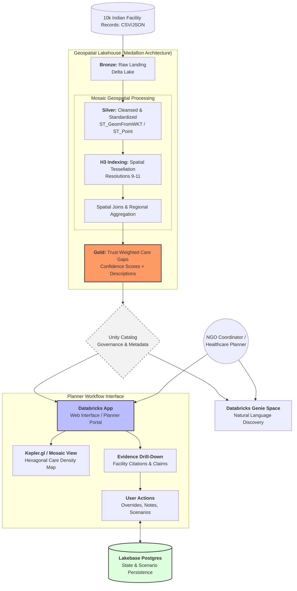

This logical architecture for the **Trust-Weighted Care Gap Navigator** leverages the Databricks Data Intelligence Platform to transform messy healthcare data into a reliable geospatial planning tool. 

The design focuses on distinguishing actual medical deserts from regions with simple data deficiencies by calculating an **Evidence-Based Confidence Score** for every healthcare claim.

### **logical_architecture.mermaid**

### **Architectural Reasoning & Impact**

1.  **Scalable Geospatial Aggregation (Mosaic + H3):**
    Instead of performing expensive "point-in-polygon" joins for every facility, the architecture uses the **Mosaic library** to tessellate coordinates into **H3 hexagonal grid cells**. This allows for near-instant aggregation of facility evidence across vast geographies like Indian states or districts.

2.  **Trust-Weighting Engine (The "Gold" Layer):**
    To satisfy the requirement of distinguishing "real gaps" from "data-poor regions," the Gold layer compares explicit **Capability Claims** (e.g., "ICU: Yes") against **Free-Text Evidence** found in the facility description. 
    *   **High Confidence:** Claim matches text evidence.
    *   **Low Confidence:** Claim made, but no supporting text or contradictory details found.
    *   **Data Desert:** No claims or descriptions exist for the region.

3.  **High-Scale Visualization (Kepler.gl):**
    The web interface utilizes **Kepler.gl** integration via Mosaic to render millions of data points with high interactivity. Planners can use visual cues—such as hexagon transparency—to represent the **Confidence Score**, highlighting where evidence is weak or suspicious.

4.  **Natural Language Discovery (Genie):**
    By exposing the Gold tables through a **Genie Space**, non-technical users can ask questions like *"Where are the highest-risk trauma gaps in Bihar with high confidence?"*. Genie translates these into SQL, drawing on the business logic already embedded in the Lakehouse.

5.  **Functional Decision Persistence (Lakebase):**
    The app moves beyond a static dashboard by using **Lakebase Postgres** (or a Delta-backed persistence layer) to save user overrides, planner notes, and specific "What-If" resource allocation scenarios. This ensures that when a coordinator identifies a facility as suspicious, that knowledge is **persisted** for the rest of the organization.